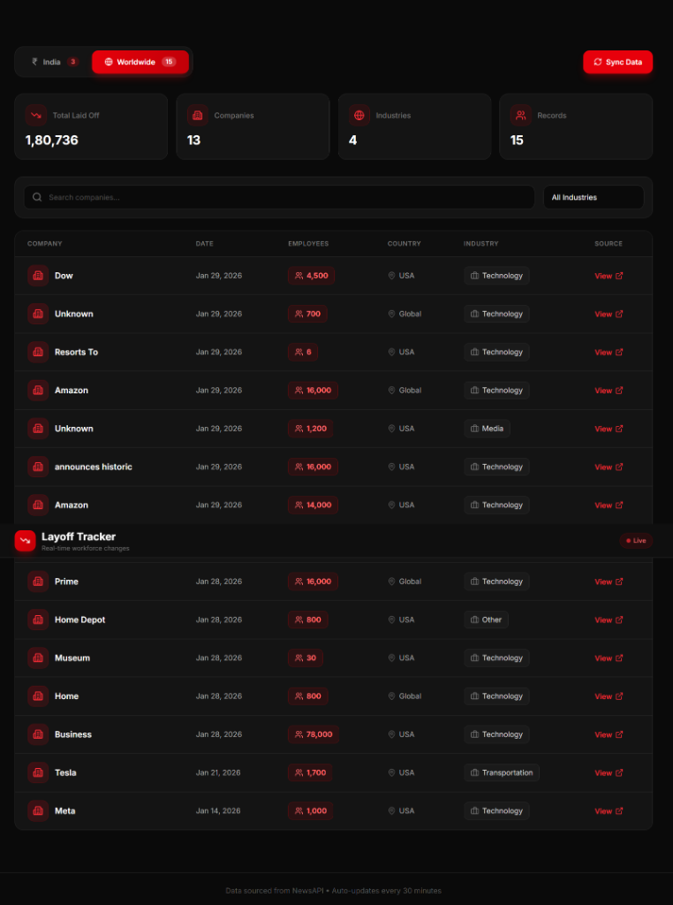

<div align="center">

# 📉 Layoff Tracker

### Real-time tracking of global workforce changes

[](https://layoff-tracker.vercel.app)
[](https://layoff-tracker.onrender.com)
[](LICENSE)

<br/>



<br/>

**Track confirmed layoffs from major companies worldwide with real-time data updates.**

[Features](#-features) •
[Tech Stack](#-tech-stack) •
[Installation](#-installation) •
[Deployment](#-deployment) •
[API](#-api-endpoints)

</div>

---

## ✨ Features

<table>
<tr>
<td width="50%">

### 🌍 **Global Coverage**
- Separate **India** and **Worldwide** sections
- Track layoffs across 15+ industries
- Real-time data from verified news sources

</td>
<td width="50%">

### 🔄 **Auto-Updates**
- Data syncs every **30 minutes**
- Manual sync available anytime
- Always up-to-date information

</td>
</tr>
<tr>
<td width="50%">

### ✅ **Verified Data Only**
- Only **confirmed layoffs** (no rumors)
- Excludes "at-risk" jobs
- Realistic counts (50 - 99,999)

</td>
<td width="50%">

### 🎨 **Premium Dark UI**
- Elegant black & red theme
- Responsive design
- Smooth animations

</td>
</tr>
</table>

---

## 🛠 Tech Stack

<div align="center">

| Frontend | Backend | Database | Deployment |
|:--------:|:-------:|:--------:|:----------:|
|  |  |  |  |
|  |  |  |  |
|  |  | | |

</div>

---

## 📁 Project Structure

```
layoff-tracker/
├── 📂 frontend/               # React + Vite frontend
│   ├── src/
│   │   ├── components/        # UI components
│   │   ├── hooks/             # Custom React hooks
│   │   ├── pages/             # Page components
│   │   └── api.ts             # API client
│   └── vercel.json            # Vercel config
│
├── 📂 backend/                # Express API server
│   ├── controllers/           # Route controllers
│   ├── routes/                # API routes
│   ├── services/              # Business logic
│   ├── server.js              # Entry point
│   └── render.yaml            # Render config
│
└── 📂 database/               # SQL schema
    └── schema.sql
```

---

## 🚀 Installation

### Prerequisites

- Node.js 18+
- npm or yarn
- Supabase account
- NewsAPI key

### Local Development

```bash
# Clone the repository
git clone https://github.com/YOUR_USERNAME/layoff-tracker.git
cd layoff-tracker

# Backend setup
cd backend
npm install
cp .env.example .env
# Edit .env with your credentials
npm run dev

# Frontend setup (new terminal)
cd frontend
npm install
cp .env.example .env
# Edit .env with your credentials
npm run dev
```

Open [http://localhost:5173](http://localhost:5173) 🎉

---

## 🌐 Deployment

### Backend → Render

1. Create a new **Web Service** on [render.com](https://render.com)
2. Connect your GitHub repository
3. Configure:

   | Setting | Value |
   |---------|-------|
   | **Root Directory** | `backend` |
   | **Build Command** | `npm install` |
   | **Start Command** | `npm start` |

4. Add environment variables:

   ```env
   NEWS_API_KEY=your_newsapi_key
   SUPABASE_URL=your_supabase_url
   SUPABASE_ANON_KEY=your_supabase_key
   PORT=5000
   NODE_ENV=production
   ```

### Frontend → Vercel

1. Import repository on [vercel.com](https://vercel.com)
2. Configure:

   | Setting | Value |
   |---------|-------|
   | **Root Directory** | `frontend` |
   | **Framework** | Vite |

3. Add environment variable:

   ```env
   VITE_API_URL=https://your-backend.onrender.com/api
   ```

---

## 📡 API Endpoints

| Method | Endpoint | Description |
|--------|----------|-------------|
| `GET` | `/api/layoffs` | Get all layoff records |
| `POST` | `/api/layoffs/sync` | Trigger data sync from NewsAPI |
| `POST` | `/api/layoffs/cleanup` | Remove duplicate entries |
| `POST` | `/api/layoffs/cleanup-large` | Remove entries with 100k+ counts |
| `GET` | `/health` | Health check |

### Example Response

```json
{
  "id": 1,
  "company_name": "Amazon",
  "layoff_date": "2026-01-29",
  "employees_laid_off": 16000,
  "country": "USA",
  "industry": "E-Commerce",
  "source_url": "https://..."
}
```

---

## 🔒 Data Validation

The tracker ensures data quality through multiple validation layers:

| Check | Description |
|-------|-------------|
| ✅ **Company Verification** | Only tracks 50+ known major companies |
| ✅ **Confirmed Layoffs** | Excludes "at-risk", "planned", "rumored" |
| ✅ **Count Validation** | Accepts 50 - 99,999 employees only |
| ✅ **Duplicate Detection** | By URL, company+count, and monthly |
| ✅ **Title Validation** | Company must appear in article title |

---

## 🤝 Contributing

Contributions are welcome! Please feel free to submit a Pull Request.

1. Fork the repository
2. Create your feature branch (`git checkout -b feature/AmazingFeature`)
3. Commit your changes (`git commit -m 'Add some AmazingFeature'`)
4. Push to the branch (`git push origin feature/AmazingFeature`)
5. Open a Pull Request

---

## 📄 License

This project is licensed under the MIT License - see the [LICENSE](LICENSE) file for details.

---

<div align="center">

**Made with ❤️ using React & Node.js**

⭐ Star this repo if you find it useful!

</div>
